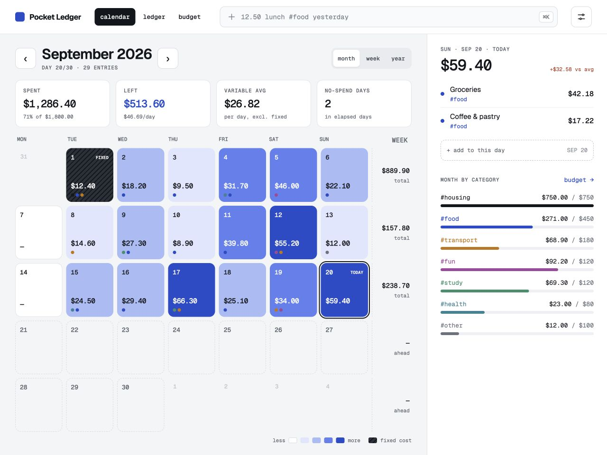

# Pocket Ledger

A private expense tracker for people who want to see where their everyday money goes. A spending calendar, searchable ledger, and budget forecast share one set of records, stored in your browser.

Small purchases are easy to lose track of; maintaining a spreadsheet takes work. Pocket Ledger lets you type an expense like a note, inspect spending by day, and plan around fixed costs without connecting a bank account.



[Mobile calendar](docs/screenshots/mobile.png) · [Ledger](docs/screenshots/ledger.png) · [Budget](docs/screenshots/budget.png) · [Command bar](docs/screenshots/command.png) · [Mobile Add](docs/screenshots/add-mobile.png). Screenshots contain synthetic reference records. New browser storage starts empty.

[Previously deployed demo — owner-only access](https://pocket-ledger-expenses.crepiks.chatgpt.site). **The redesign in this branch has not been deployed.** Run it locally using the commands below; the hosted demo is an older revision.

## Run locally

Use Node.js **24.21.0**, pinned in [`.nvmrc`](.nvmrc). No API keys, account, or environment variables are required.

```sh
git clone https://github.com/Crepiks/fintech-expense-tracker-shot-1.git
cd fintech-expense-tracker-shot-1
nvm install
nvm use
npm ci
npm run dev
```

Open the address printed by Vite, normally `http://127.0.0.1:5173`. Check out the redesign branch when running this work before integration into `trunk`.

```sh
npm test              # Unit + component tests, enforcing 100% coverage per file
npm run typecheck     # Strict TypeScript checks, including tests
npm run build         # Production files in dist/
npm run preview       # Serve dist/ locally
```

`npm ci` uses the committed lockfile. `npm run test:watch` starts Vitest in watch mode. CI uses the pinned Node version and runs tests and the production build.

## Use the app

### Calendar

The calendar opens on the current local month. Choose a day to inspect its expenses, then **add to this day** to preselect that date. The blue intensity represents variable spending; hatched cells contain fixed costs. Desktop shows category dots, weekly totals and a category sidebar. Mobile uses a seven-column grid, selected-day card, and fixed bottom navigation.

Month, week and year views are available on desktop. Their arrows move one month, seven days, or one year respectively. Choose a month in the year view to return to its calendar. Months are isolated across the calendar, ledger and budget.

### Quick entry and commands

Tap **+** on mobile or the command bar on desktop. **⌘K / Ctrl+K** opens or closes quick entry. The live preview shows what will be saved. **Enter** saves; **Shift+Enter** or **add & keep open** saves and keeps the bar ready. **Escape** cancels. A labelled manual form is available under **prefer a form?**.

```text
12.50 lunch with Aida #food
20 bus pass #transport yesterday
58 textbook #study sep 17
25 pharmacy #health 2026-09-18
/budget 1800
/budget #food 450
/budget #food off
/repeat phone 25 monthly #other
/find #fun >20
/export
/export sep csv
/undo
```

- Expense amounts come first; notes are optional. Supported tags are `#food`, `#transport` (also `#transportation`), `#housing`, `#study`, `#fun`, `#health`, and `#other`. Missing tags use Other; unknown or multiple tags produce a clear error.
- Dates go at the end: `today`, `yesterday`, weekday abbreviations (`mon`–`sun`, most recent occurrence including today), month/day (`sep 12`, current year), or `YYYY-MM-DD`. An undated note uses the selected calendar day when opened from **add to this day**, otherwise today. Explicit relative dates always refer to the real current date.
- `/budget off` clears the shared monthly limit. Category limits are optional and independent of the monthly limit.
- `/repeat` creates a monthly fixed cost on today's day of the month. Shorter months clamp the day to their last day. It records the first charge today and generates due charges on later app visits or local day changes. Stop a rule in Budget; already recorded expenses remain.
- `/find` opens the ledger with a query. `/export` exports the selected month; a named month uses the selected year's month.
- `/undo` removes the most recent quick/manual entry from this session. Deletion shows a five-second **Undo** toast, which restores the exact current record. Native text undo remains available in text fields.
- Recent suggestions and category tokens use actual records. Custom tags and invented suggestions are never silently created.

The manual amount field accepts `1500`, `1 500`, `1,500`, `1500,50`, and `1500.5`. Quick-entry amounts occupy one token, so use `1,500` for grouped thousands. Invalid/zero/negative amounts, exponent notation, and more than two decimal places are rejected. Future dates are allowed and visibly identified.

### Ledger, editing and CSV

The ledger groups records by day, newest first. Select a category chip, or combine search terms with AND:

```text
#fun >20
note:lunch
sep 10..17
2026-09-10..2026-09-17
#food >=10 <=30
```

Plain text searches descriptions, case-insensitively. Malformed filters match no records. Filtered counts, totals and daily groups describe the visible results; Budget and Calendar continue to use the full month. The desktop running budget balance also includes filtered-out records.

Select any expense to change its amount, category, date, note or fixed-cost flag, or to delete it. Fixed costs are explicit, not inferred from Housing. Deleting the final record in an active category clears that filter; Undo returns to the full ledger.

**Import CSV** validates the entire file before offering import. It appends records, preserves existing records, and does not deduplicate repeated imports. The 2 MB file limit and 10,000 total-record limit are checked before insertion. Quoted commas/newlines, escaped quotes, BOM, and CRLF are supported.

```csv
date,description,category,amount,fixed
2026-09-01,Rent,Housing,750.00,true
2026-09-20,Coffee,Food,4.40,false
```

Column order is fixed; a legacy four-column file without `fixed` is also accepted. CSV category values use their full names (`Transportation`, not `transport`). Export covers all records in the selected month, regardless of the active filter. Formula-like notes are escaped for spreadsheet safety. CSV contains expenses and fixed flags, **not budget settings or recurring rules**.

### Budget

Set the overall monthly limit and optional category limits; desktop inputs save on blur or Enter. On mobile choose **edit limits**, edit, then **done**. Blank inputs clear a limit. Limits persist across reloads and apply to every month; there are no separate historical budgets.

- The chart plots actual cumulative spending, a budget pace line, and a month-end estimate. A compact chart appears on mobile.
- Variable daily average uses only elapsed calendar days and excludes fixed costs. No-spend days are elapsed days with no recorded expense, not a claim about untracked real spending.
- Forecast = spending through today + future fixed costs + the larger of known future variable spending or observed variable daily pace × remaining days. Pending recurring fixed costs count once. Past months show their actual total; future months show known/planned costs.
- Safe daily allowance reserves pending fixed costs and divides the remaining budget by days left **including today**, rounded down. Negative availability displays zero on the main views; Settings hides the daily guidance when unavailable. This intentionally differs from the reference prototype's example, which divides by days after today.
- Category markers show elapsed-month pace. Status is **NO LIMIT**, **OK**, **WATCH**, **OVER**, or **PAID** for an entirely fixed, recorded category within its limit. These are arithmetic indicators, not financial predictions.
- Settings retains the optional stipend day (1–31), including shorter-month clamping and a countdown. It is separate from the calendar-month budget. Access Settings from the desktop header or the Budget footer on mobile.

## Validation and architecture

**Stack:** React 19, TypeScript, Vite, plain CSS; Vitest, Testing Library and jsdom for tests. React and React DOM are the only application runtime dependencies. There is no backend, UI kit, chart library, router, or model API. Geist fonts are bundled locally with their SIL Open Font Licenses.

```text
Quick entry / forms / CSV → validation → reducer → useExpenses → localStorage
                                               ↓
                                  one month of expense records
                                               ↓
                              Calendar · Ledger · Budget forecasts
```

- `src/domain/`: pure money/date validation, commands, search, CSV, recurrence, totals and forecasts.
- `src/storage/`: version-1 schema recovery, persistence, cross-tab events, and local CSV downloads.
- `src/state/`: reducer, persistence hook, and local-day clock (refreshes at midnight and on returning to the tab).
- `src/components/`: responsive views, entry/editor/import dialogs, reusable display components. `App.tsx` coordinates navigation and actions.
- `src/styles/`: shared tokens/controls and view-specific mobile-first styles, with desktop rules separated.
- `tests/`: mirrors production modules and includes end-to-end component flows for import, editing, Undo, commands, recurrence and persistence.

Money is stored as integer minor units: `150000` means USD 1,500. Parsing does not multiply floating-point inputs to derive money. Totals are calculated, never stored. The 999,999,999.99 amount limit and 10,000-record limit keep aggregates within safe integers. `CURRENCY` in `src/config.ts` is USD; changing its label is not a currency conversion.

The test configuration enforces **100% lines, branches, statements and functions per application file**. Only `src/main.tsx`, which mounts React, is excluded; mounting is checked in the browser. Tests assert behavior with deterministic clock/storage/file boundaries. See [verification evidence](docs/verification.md) for current results and design comparisons.

Settings also contains **Run validation scenario**: it runs the real reducer/calculations in memory without touching stored data. Adding Food 1,500, Transportation 600 and Food 900 must produce 3,000 total; deleting Food 900 leaves 2,100. All ten checks include counts and category-total equality.

## Storage and limitations

- Data stays in this browser profile and origin. Existing version-1 expenses, budgets and stipend settings load without a reset. Optional category limits, fixed flags and recurrence fields extend that schema.
- Same-origin tabs synchronize snapshots using last-write-wins. Truly simultaneous edits can replace one another; this is not a transactional multi-user store.
- Corrupt data is recovered with a visible notice and a raw backup at `expense-tracker:v1:backup` when space permits. Invalid/duplicate records are removed. Blocked/full storage shows a warning while the current tab remains usable.
- Clearing browser data removes records. The app does not encrypt storage. There is no account, cloud/device synchronization, bank connection, multi-currency support, custom category creation, or separate per-month limits.
- Recurrence runs while the app is open or when it is reopened; there is no background service. If the record limit blocks a charge, freeing space lets it resume. Deleted occurrences stay deleted; stopping a rule preserves past entries.
- No application-data network requests or remotely hosted assets are used. Recording and calculations work once loaded without internet. **Offline reload/install is not supported**: no service worker is included.
- Modern browsers with native `<dialog>` support are required. Browser QA uses the Codex in-app browser at desktop and mobile viewport sizes; real phone keyboards and other browser engines are not claimed tested.

The supplied HTML exports include illustrative suggestions, sample data, and a hint that arbitrary tags could be created. Those are not persisted production features: the implemented category system deliberately retains the seven validated categories. Separate historical budgets and custom categories would need additional storage/editor workflows. These are the remaining design-adjacent items on the roadmap, rather than inert controls in the main flow.

## Deployment and repository workflows

`npm run build` produces `dist/`; any static HTTPS host can serve it. Vite uses `base: './'` for relative asset paths. `.openai/hosting.json` retains the existing static Sites setup. This task does not change the hosted deployment. Double-clicking `dist/index.html` is unsupported; use the preview server or a static host.

Agent instructions and repository skills are mirrored in [`.agents/skills/`](.agents/skills/) and [`.claude/skills/`](.claude/skills/). Keep both copies identical. All work uses a task branch and reaches `trunk` through a PR; commits use Conventional Commits. The imported Vercel skill copies remain at revision `063bee94c3f4df8453406c830b0a7df0f2860278`.
